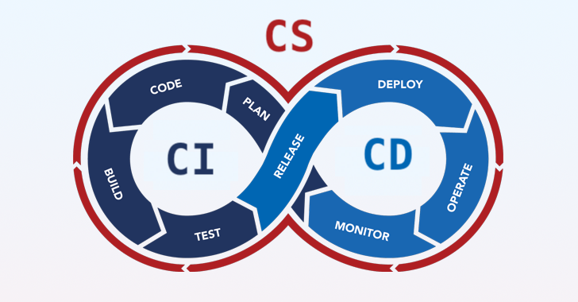
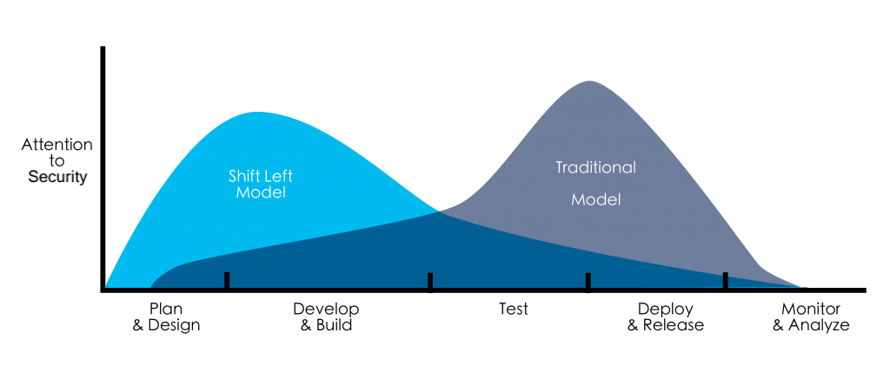

# Perfect Pipeline Introduction

This workshop is designed to help you understand the importance of shift-left security and how to implement comprehensive security scanning in your pipeline.

All of this without forgetting the human factor, as the final objective is not blind security but enabling your users (or yourself) to build secure software effectively.

Let's start with some important concepts:

### What is a Pipeline? CI/CD/CS?

A pipeline is a series of automated steps that build, test, and deploy software. It is a key part of the software development lifecycle and helps ensure that software is delivered with high quality and security.

Related to pipelines, you have probably heard about the concepts of Continuous Integration and Continuous Delivery. But to build a truly modern and resilient pipeline, we need to formally add a third component: Continuous Security.

- **Continuous Integration (CI)**: This is where developers merge code into a shared branch multiple times a day. Every merge kicks off an automated build and test, ensuring the mainline of your code is never broken for long.

- **Continuous Delivery (CD)**: This takes CI a step further. It’s an automated process that ensures any change passing the tests can be safely deployed to production with a single click, making release day a non-event.

- **Continuous Security (CS)**: This is the crucial next step in the evolution, embedding security into the process. It means automating security controls and tests throughout the pipeline, just like we do for quality, to find vulnerabilities when they are cheapest and easiest to fix.

### What is Shift-Left Security?

Shift-left security is a security practice that aims to move security checks and mitigations as early as possible in the software development lifecycle. This approach helps catch security issues early, before they reach production, and reduces the risk of vulnerabilities being exploited.

<em>Based on the image from https://devopedia.org/shift-left</em>

## Workshop Index
We suggest you follow the workshop in the following order, but feel free to jump around and explore the different modules.

1. [Pipeline Security Scan](pipeline_scan/)
2. [Code Security Analysis](code_scan/)
3. [Secrets Scan](secrets_scan/)
4. [Container Security Scanning](container_scan/)
5. [Infrastructure as Code Security Scan](iac_scan/)
6. [Runtime Infrastructure Scan](runtime_infra_scan/)
7. [AI Security Analysis](ai_scan/)

## Workshop flow
To begin, fork this repository. Then, for each module:
1. Read the README.md file.
2. For each tool within that module, follow the instructions in the `workflow.yml` file.
3. Push your changes and observe the results.
4. Work to fix any issues for that step until you achieve a green pipeline ✅.
5. Then, try a different tool (if available) or proceed to the next module.
