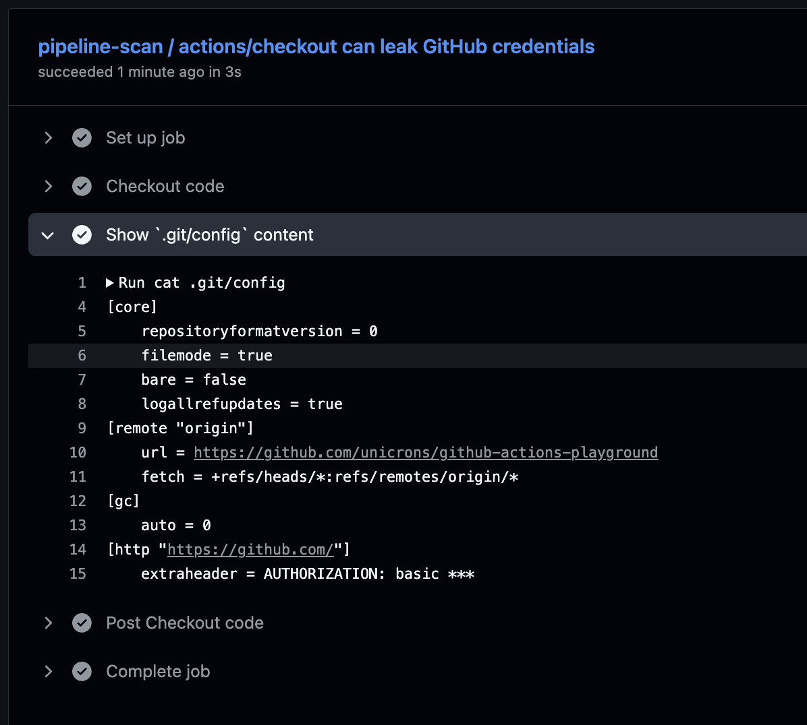

# `actions/checkout` Can Leak GitHub Credentials

> Based on the article, [actions/checkout can leak GitHub credentials](https://yossarian.net/til/post/actions-checkout-can-leak-github-credentials/), from [William Woodruff](https://github.com/woodruffw)

This exercise demonstrates what William explained in his article: that by default, `actions/checkout` can silently leak GitHub credentials to the workflow runner.

If you copy the following block of code into the `pipeline-scan.yml`, replacing the `jobs` section, you will see that the `actions/checkout` action will leak the GitHub credentials to the runner.

```yaml
jobs:
  checkout-leak:
    name: "actions/checkout can leak GitHub credentials"
    runs-on: ubuntu-latest
    permissions:
      contents: read # As we're going to expose this file, let's limit the permissions

    steps:
      - name: Checkout code
        uses: actions/checkout@v4

      - name: Show `.git/config` content
        run: |
          cat .git/config
```

Not that easy, trying just this won't work because the value will be masked:



But, if we add this step to upload the `.git/config` file as artifact:

```yaml
      - name: Upload .git/config
        uses: actions/upload-artifact@ea165f8d65b6e75b540449e92b4886f43607fa02 # v4.6.2
        if: always()
        with:
          name: git-config
          path: .git/config
          retention-days: 1
```

We can download and see the credentials:

```bash
$ cat .git/config

[core]
	repositoryformatversion = 0
	filemode = true
	bare = false
	logallrefupdates = true
[remote "origin"]
	url = https://github.com/unicrons/github-actions-playground
	fetch = +refs/heads/*:refs/remotes/origin/*
[gc]
	auto = 0
[http "https://github.com/"]
	extraheader = AUTHORIZATION: basic <the GitHub token as base64>
```

And we can test it works by running the following command:

```bash
$ curl -H "Authorization: basic $(echo $GH_TOKEN | base64)" \
       "https://api.github.com/repos/unicrons/github-actions-playground"
{
  "id": 1004909337,
  "node_id": "R_kgDOO-WzGQ",
  "name": "github-actions-playground",
  "full_name": "unicrons/github-actions-playground",
  "private": false,
  [...]
```

> ![NOTE]
> I did not find a way to use the GitHub Actions Token to enumerate informations without knowing previously the name of the repository or the organization.

As mentioned in the article, you can avoid this using the `persist-credentials` option:

```yaml
uses: actions/checkout@v4
with:
  persist-credentials: false
```

Now the `.git/config` will look like this:

```bash
$ cat .git/config

[core]
	repositoryformatversion = 0
	filemode = true
	bare = false
	logallrefupdates = true
[remote "origin"]
	url = https://github.com/unicrons/github-actions-playground
	fetch = +refs/heads/*:refs/remotes/origin/*
[gc]
	auto = 0
```


## References
- [Use GITHUB_TOKEN in workflows](https://docs.github.com/en/actions/tutorials/use-github_token-in-workflows): Learn how to use the GITHUB_TOKEN to authenticate on behalf of GitHub Actions.
- [actions/checkout can leak GitHub credentials](https://yossarian.net/til/post/actions-checkout-can-leak-github-credentials/)
